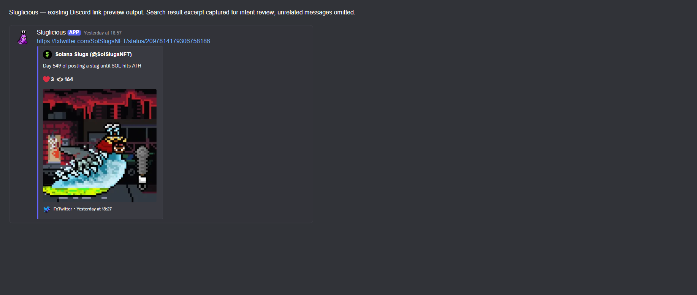
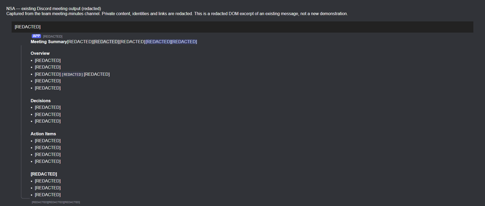

# Discord privileged-intent review evidence

Captured on 10 September 2026 from existing Discord messages using the configured
browser. These images are rendered DOM excerpts of real bot output, not newly
generated bot messages or synthetic demonstrations. Unrelated channel UI and
messages are omitted. The captions identify the presentation changes.

## Sluglicious

This excerpt shows Sluglicious's replacement preview for a public Sol Slugs post.
It is an output example, not a recording of the input event or a demonstration
of every feature. The implementation is public:

- [Link-preview handling](https://github.com/zpalmtree/dave/blob/slugs/lib/ConvertTwitterLinks.ts)
- [Channel-summary handling](https://github.com/zpalmtree/dave/blob/slugs/lib/Summarize.ts)
- [Discord message routing](https://github.com/zpalmtree/dave/blob/slugs/lib/index.ts)

## NSA private meeting assistant

This excerpt preserves the structure of an existing meeting-summary message.
Private meeting text, participant identities and links were replaced with
`[REDACTED]` before capture. It illustrates the output format, but cannot show the
underlying meeting-chat input or establish its relationship to the summary.
A non-confidential demonstration may be needed if the reviewer requires that
evidence. NSA's source and meeting records remain private.

See the [NSA privacy policy](../nsa-privacy.md) and
[Dave/Sluglicious privacy policy](../../PRIVACY.md).
